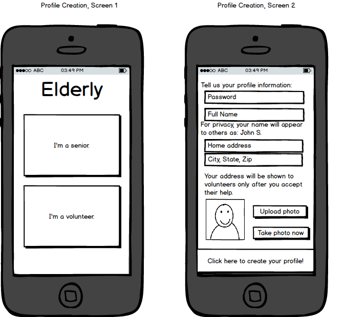
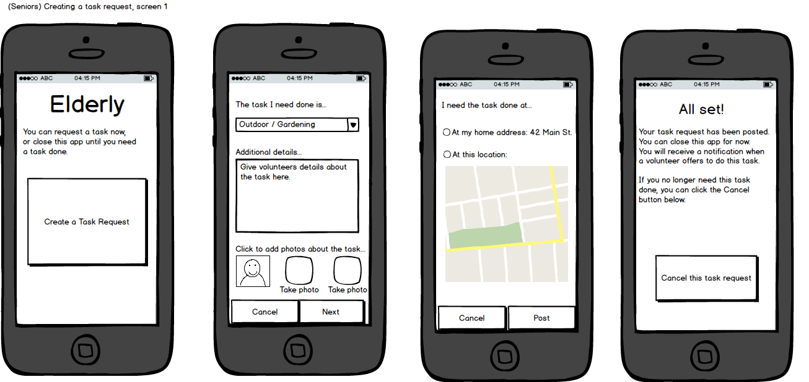
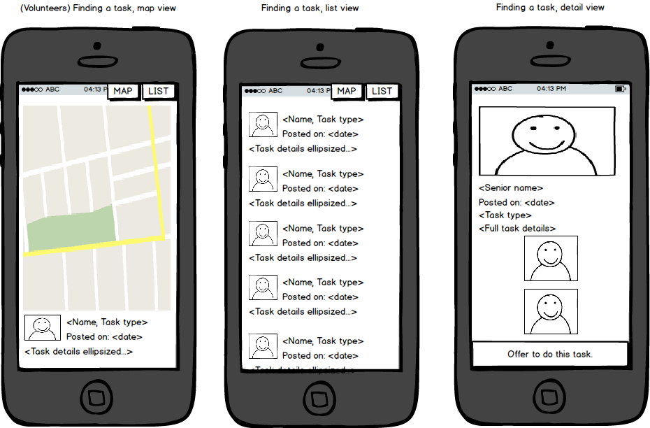
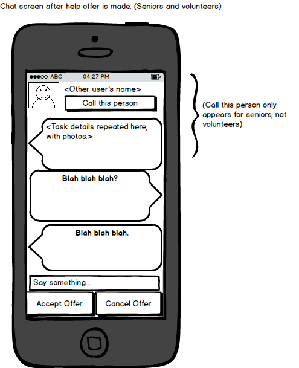
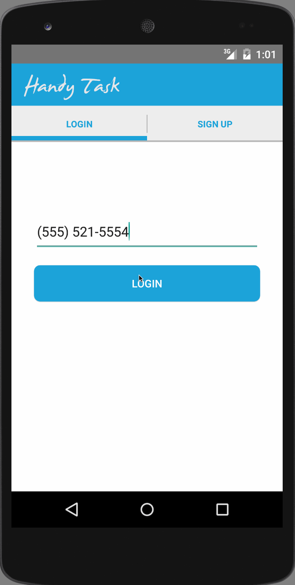

# HandyTask

Hetang Shah, Vince Tulit, Al Sweigart

HandyTask is an app that connects Expertes with requestor to help them with tasks or small house work. Whether it's moving furniture, tech support, or painting wall, HandyTask provides individual help to enable people to live comfortably without expensive contracts. HandyTask is a TaskRabbit app powered by the expert people to earn in the community. Experts can help as frequently as they want according to their own availability, without the entrance barrier of long-term commitment.

Required stories:

 * [x] Experts and users can create profiles of their contact information.
 * [ ] User can posts its needs to the server.
 * [x] Experts will see the need and use a map interface to find tasks near them.
 * [ ] Experts and user can enter a chat with each other for exchanging questions, details and expert's portfolio.
 * [ ] User receive a system notification when a experts respond to need.
 * [ ] Experts can upload a portfolio photos or use the phone's camera.
 * [ ] GPS will locate the user as a starting point for searches/task posts.
 * [ ] User can press a button in chat to have their phone call with experts.

Optional stories:

 * [ ] Users can sign in with their Facebook profile.
 * [ ] Users can modify their profile details.
 * [ ] Users can provide feedback about their experience for each need.
 * [ ] Experts also can provide feedback about the whole process after responding to user need.
 * [ ] Needs to build payment system to exchange money between user and expert after completing.

# Wireframes:

 
 
 
 
 
# Week1 Progress:
### Hetang's Work
 
